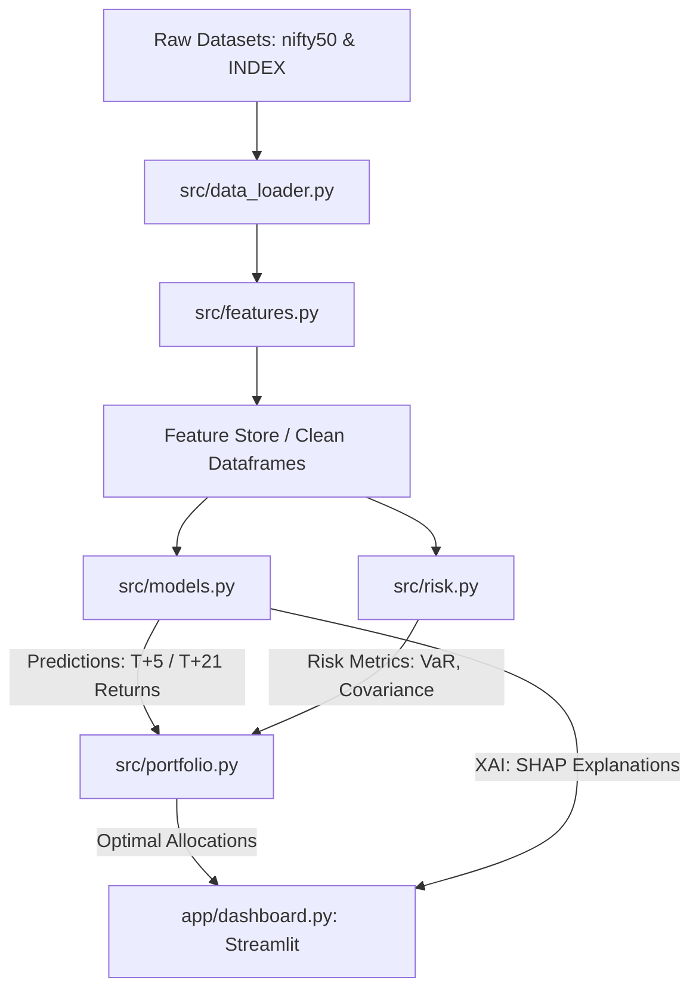

# NIFTY-50 AI Investment Intelligence Platform: ARCHITECTURE & PLAN

This document details the comprehensive system architecture, data flow, feature engineering plan, and development roadmap for building a state-of-the-art Investment Intelligence Platform using the NIFTY-50 constituent stocks and market indices (2000–2021).

---

# Problem Understanding

### Core Objective
The goal is to move beyond simple next-day price forecasting (which is highly noisy, unstable, and functionally useless for real-world trading) and develop an **AI-powered Decision-Support and Investment Intelligence Platform**. The platform must ingest historical equity prices and volume, combine them with macro indices and market volatility indicators, and output:
1. **Medium-Term Alpha Predictions**: Forward returns or directions over realistic horizons (e.g., 5-day or 21-day holding periods).
2. **Risk-Averse Portfolio Construction**: Asset allocations tailored to specific risk profiles (Conservative, Balanced, Aggressive).
3. **Transparent Risk Assessment**: Dynamic measures of downside risk (Drawdowns, Value at Risk, CVaR).
4. **Explainable Recommendations**: Interpretability of stock predictions and portfolio weights to build user trust.

### Real-world Quant Constraints & Hackathon Focus
* **Data Limits**: Only use the provided historical NSE datasets. Live market data, alternative datasets (sentiment, news), and external APIs are strictly prohibited.
* **Investment Intelligence > Model Complexity**: Simple models with sound financial logic (e.g., transaction cost penalties, covariance shrinkage, risk parity) score higher than black-box deep learning models that overfit noisy market data.
* **Practical Usability**: Deliver a highly interactive web prototype (Streamlit dashboard) backed by a comprehensive technical report.

---

# Dataset Analysis

The workspace contains three key dataset folders spanning **January 2000 to April/July 2021**:

1. **Constituent Equity Data (`data/nifty50/`)**:
   * Individual daily CSV files for each NIFTY-50 stock (e.g., `INFY.csv`, `TCS.csv`, `RELIANCE.csv`).
   * Schema: `Date`, `Symbol`, `Series` (EQ), `Prev Close`, `Open`, `High`, `Low`, `Last`, `Close`, `VWAP`, `Volume`, `Turnover`, `Trades`, `Deliverable Volume`, `%Deliverble`.
   * **Data Note**: Volume-weighted average price (`VWAP`) is crucial for clean entry/exit simulation. `Trades` column is sparse/missing in the early years (pre-2011).
   * **Aggregation File**: `NIFTY50_all.csv` contains a pre-merged vertical stack of all constituent rows, useful for fast training.
   * **Sector Metadata**: `stock_metadata.csv` maps each symbol to its industry classification (e.g., IT, Financial Services, Consumer Goods, Pharma).

2. **Market Indices & Volatility (`data/archive (1)/Datasets/INDEX/`)**:
   * **`NIFTY 50.csv`**: Daily benchmarks (Open, High, Low, Close, Volume, Turnover) representing the macro market regime.
   * **`INDIA VIX.csv`**: Volatility index close prices (starts July 2010). Acts as the primary proxy for market sentiment, fear, and regime changes.
   * **Sectoral Indices**: Sector-specific indexes (e.g., `NIFTY BANK.csv`, `NIFTY IT.csv`) which allow computation of sector-specific relative returns and relative strength metrics.

3. **Data Quality Challenges & Mitigations**:
   * **Survivor Bias**: Constituent stocks change over 20 years. We must use the provided metadata to understand industry rotations.
   * **Temporal Alignment**: Stocks have varying listing start dates (e.g., `ADANIPORTS` listings begin in 2007). All features must be merged on a common daily timeline using standard forward-filling.
   * **VIX Missingness**: `INDIA VIX` data starts in 2010. We will design a dual training approach:
     * *Global Model (2000-2021)*: Technical, sectoral, and momentum indicators (excluding VIX) to capture long-term macro cycles.
     * *Modern Regime Model (2010-2021)*: Adds VIX features to optimize predictions during high-volatility regimes.

---

# Recommended Project Architecture

A clean, modular architecture separating data ingestion, feature extraction, modeling, portfolio mathematics, and frontend deployment:



### Module Descriptions
* **`src/data_loader.py`**: Performs time-series alignment, missing value imputation, out-of-bounds error cleaning, and sector mapping.
* **`src/features.py`**: Calculates all mathematical overlays (RSI, Bollinger Bands, rolling volatility, Index beta, and sector momentum).
* **`src/models.py`**: Houses baseline models (Ridge) and advanced classifiers/regressors (LightGBM, XGBoost) using walk-forward temporal cross-validation.
* **`src/portfolio.py`**: Implements Modern Portfolio Theory (MPT) formulations, covariance shrinkage (Ledoit-Wolf), Black-Litterman adjustments, and Risk Parity models.
* **`src/risk.py`**: Computes parametric/historical Value at Risk (VaR), Conditional VaR (CVaR), Beta, Drawdowns, and stress-test shock multipliers.
* **`src/explainers.py`**: Generates tree-based feature importances and local SHAP explanation values.
* **`app/dashboard.py`**: Streamlit visualization dashboard containing portfolio backtests, stock selectors, and risk analytics.

---

# Folder Structure

The project will follow a clean, production-grade structure to secure maximum points for **Reproducibility & Documentation (15%)**:

```
NIFTY-AI-Platform/
├── data/                             # Raw datasets (Read-Only)
│   ├── nifty50/                      # Constituent equities
│   └── archive (1)/
│       └── Datasets/
│           ├── INDEX/                # Nifty Benchmarks & INDIA VIX
│           └── SCRIP/                # All NSE Scrips
├── src/                              # Modular python source code
│   ├── __init__.py
│   ├── config.py                     # Constants, hyperparams, and plot styles
│   ├── data_loader.py                # CSV parsers and temporal alignments
│   ├── features.py                   # Indicators (TA-Lib / Pandas implementation)
│   ├── models.py                     # LightGBM/XGBoost training & walk-forward CV
│   ├── portfolio.py                  # MVO and Black-Litterman optimizers
│   ├── risk.py                       # Volatility, VaR, CVaR, and stress engines
│   └── explainers.py                 # SHAP explainer configurations
├── app/                              # Streamlit deployment
│   └── dashboard.py                  # Main visualization dashboard
├── notebooks/                        # Research and prototyping
│   ├── 1.0_exploratory_analysis.ipynb
│   └── 2.0_backtesting_validation.ipynb
├── reports/                          # Generated plots and report drafts
├── ARCHITECTURE.md                   # System design blueprint
├── requirements.txt                  # Python dependencies
└── README.md                         # Quickstart setup and usage manual
```

---

# Feature Engineering Plan

Features are divided into four distinct classes and calculated rolling-window style to avoid any **lookahead bias**:

### 1. Technical Indicators (Stock Level)
* **Simple Moving Average (SMA)** & **Exponential Moving Average (EMA)**:
  * Calculations: 10, 20, 50, and 200 days on `Close` prices.
  * Derived: Distance metrics (e.g., `Close / SMA(20) - 1`) and crossover flags (e.g., EMA(10) crossing EMA(50)).
* **Relative Strength Index (RSI)**:
  * Window: 14-day standard Wilder's RSI.
  * Derived: Overbought (>70) and Oversold (<30) categorical signals, and RSI rate of change.
* **MACD (Moving Average Convergence Divergence)**:
  * Fast Line: 12-day EMA. Slow Line: 26-day EMA. Signal Line: 9-day EMA of MACD.
  * Derived: MACD Histogram value and signal crossovers.
* **Bollinger Bands**:
  * Calculation: Rolling 20-day SMA +/- 2 rolling Standard Deviations.
  * Derived: Bandwidth (measure of squeeze) and Price Location (e.g., `(Close - Lower Band) / (Upper Band - Lower Band)`).

### 2. Momentum & Volatility Features
* **Momentum (ROC)**: 5-day, 10-day, and 21-day Rate of Change of stock close prices.
* **Average True Range (ATR)**: 14-day rolling window of True Range to measure absolute volatility.
* **Rolling Volatility**: Rolling 10-day, 20-day, and 60-day standard deviation of log returns, annualized:
  $$\sigma_{ann} = \text{std}(\ln(C_t/C_{t-1})) \times \sqrt{252}$$
* **Volume Momentum**: Ratio of current volume to its rolling 20-day average (`Volume / SMA(Volume, 20)`).

### 3. Market Index & Sectoral Features
* **Index Momentum**: Rolling returns of the NIFTY 50 index (5-day, 21-day).
* **Sectoral Momentum**: Return of the sectoral index associated with each stock symbol (e.g., calculating NIFTY BANK momentum for HDFCBANK).
* **Systematic Beta ($\beta$)**: Rolling 60-day covariance of stock returns with NIFTY 50 returns divided by index variance:
  $$\beta = \frac{\text{Cov}(R_{stock}, R_{index})}{\text{Var}(R_{index})}$$

### 4. VIX Features (Regime Identifiers)
* **India VIX Close**: Absolute level of VIX to proxy market uncertainty.
* **VIX Volatility Trend**: 5-day rolling change in VIX. Spikes in VIX trigger risk-off modeling modes.
* **VIX Interaction**: Beta adjusted by VIX ($\beta \times \text{VIX}$) to identify high-systematic-risk equities during market corrections.

---

# Prediction Module

Instead of predicting next-day close prices, the platform targets **forward returns over a multi-day holding period (T+5 and T+21)**. 

### Target Formulation
1. **Regression Target**: $y^{reg}_t = \frac{Price_{t+k} - Price_t}{Price_t}$ (where $k \in \{5, 21\}$).
2. **Classification Target**: $y^{class}_t = 1$ if stock return outperforms NIFTY-50 return over $[t, t+k]$ by $> 0.5\%$, else $0$. (Helps identify alpha generators).

### Recommended Models
1. **LightGBM / XGBoost (Primary Workhorses)**:
   * *Justification*: Excellent performance on tabular datasets with non-linear interactions. High resistance to outliers. Fast training allows rolling walk-forward cross-validation. Natively handles missing data (e.g., VIX data pre-2010).
2. **Ridge Regression (Baseline)**:
   * *Justification*: Imposes L2 regularization to prevent overfitting on noisy financial markets. Serves as a benchmark to justify the complexity of LightGBM.
3. **Random Forest Classifier**:
   * *Justification*: Generates robust ensembles that reduce variance on noisy labels. Used for consensus voting in classifying stock directional movements.

### Validation Strategy (No-Leakage Temporal Split)
To prevent lookahead leakage, **Purged Walk-Forward Time-Series Split** is mandatory:
* Train Window: Fixed rolling window (e.g., 5 years).
* Purging Gap: A gap of $k$ days between train and test windows to prevent overlapping target leakage.
* Test Window: Out-of-sample forward step (e.g., 1 year).

---

# Portfolio Construction Module

The portfolio construction engine translates stock predictions (alpha returns) and risk metrics (covariance) into asset weights. We recommend three core allocations mapped to user risk profiles:

| Profile | Goal | Optimization Technique | Constraints |
| :--- | :--- | :--- | :--- |
| **Conservative** | Capital Preservation | **Minimum Variance Optimization (MVO)** | Max weight per stock $\le 5\%$, sector exposure $\le 20\%$. Focuses on low-beta, low-volatility sectors (FMCG, Pharma). |
| **Balanced** | Growth & Protection | **Maximum Sharpe Ratio Portfolio (Tangency)** | Max weight per stock $\le 10\%$, sector exposure $\le 25\%$. Covariance matrix shrunk using Ledoit-Wolf shrinkage. |
| **Aggressive** | Market Outperformance | **Black-Litterman Portfolio** | Max weight per stock $\le 15\%$. Integrates predictions from the ML model as subjective "views" with market capitalization equilibrium weights. |

### Advanced Allocations
* **Risk Parity**: Allocates weights such that each asset contributes equally to the total portfolio risk:
  $$w_i \times (\Sigma w)_i = \text{constant for all } i$$
  This acts as a secondary risk-managed benchmark.

---

# Risk Assessment Module

To deliver comprehensive investment intelligence, the platform calculates risk dynamically at both the **individual stock** and **aggregate portfolio** levels:

1. **Risk Adjusted Returns**:
   * **Sharpe Ratio**: Annualized return over risk-free rate (assumed at 6.5% for India) divided by annualized volatility.
   * **Sortino Ratio**: Volatility replaced by downside semi-deviation (penalizing only negative returns).
2. **Downside Risk Metrics**:
   * **Maximum Drawdown (MDD)**: Maximum peak-to-trough decline of the portfolio value over the historical backtest.
   * **Value at Risk (VaR)**: 95% and 99% 1-day holding period VaR using historical simulation and parametric methods.
   * **Conditional Value at Risk (CVaR)**: Expectation of loss exceeding the VaR threshold (capturing tail risk).
3. **Macro Stress Testing**:
   * Simulates portfolio behavior under historical NSE market shocks:
     * *2008 Global Financial Crisis Shock*: -30% market index drop, VIX spike to 50.
     * *2020 COVID-19 Liquidity Crisis*: -25% market index drop, VIX spike to 80.
     * *Sector Specific Shock*: -15% drop in IT or Bank indices.

---

# Explainable AI Module

Explainability is key to establishing investment credibility. The system features a built-in translation layer:

1. **Global Explainability**:
   * **Permutation Feature Importance**: Ranks which features (e.g., VIX levels, sector momentum, RSI) are most critical to the model's global prediction performance.
   * **SHAP Summary Plots**: Illustrates the direction of feature impacts on returns across the entire NIFTY-50 dataset.
2. **Local Explainability (Per Stock Recommendation)**:
   * **SHAP Waterfall Plots**: Breaks down the precise reasons why a specific stock was given a "Buy" or "Sell" signal on a given day.
     * *Example Output*: "Reliance is rated a Strong Buy because its price is near the Lower Bollinger Band (+2.1%), sector momentum is strong (+1.5%), and India VIX is falling (-0.8%)."
3. **Technical Translation Layer**:
   * Simple rule-based translation to convert complex statistical values into human-readable investment theses (e.g., "RSI at 28 indicating oversold conditions, representing a mean-reversion opportunity").

---

# Streamlit Dashboard Design

An elegant, dark-themed dashboard built for visual excellence and responsive interaction:

### Navigation Structure
* **Page 1: Market Pulse (Macro EDA)**:
  * NIFTY-50 Index & India VIX trend comparison line charts.
  * Interactive sector performance treemaps.
  * Sparsity and correlation matrix heatmaps for the selected time horizon.
* **Page 2: Alpha Predictor Engine**:
  * Stock selection dropdown (TCS, INFY, etc.) displaying close prices, volumes, and technical overlays.
  * Predicted return over T+5 and T+21 days.
  * Dynamic SHAP local contribution plots explaining the active model signal.
* **Page 3: Portfolio Simulator**:
  * User input inputs: Investment value, sector limits, and Risk Profile selector (Conservative, Balanced, Aggressive).
  * Asset allocation weights displayed in high-contrast Plotly pie charts.
  * Historical portfolio backtest comparison (Portfolio Return vs NIFTY-50 Benchmark) with interactive performance metrics cards.
* **Page 4: Risk Analytics & Stress Room**:
  * VaR & CVaR gauge charts.
  * Drawdown profile over time.
  * Stress-testing shock dashboard where users can apply a market shock and see simulated portfolio drawdowns immediately.

---

# Evaluation Metrics

The platform is evaluated against rigorous predictive and financial benchmarks:

### 1. Model Prediction Accuracy
* **Regression Metrics**:
  * Mean Absolute Error (MAE): Measures average prediction deviation.
  * Root Mean Squared Error (RMSE): Penalizes large prediction errors.
  * Out-of-sample $R^2$ Score: Assesses prediction power relative to the historical mean.
* **Classification Metrics**:
  * Precision: Crucial for avoiding false-positive "Buy" signals (minimizing capital losses).
  * Recall & F1-Score: Measures signal coverage.
  * Directional Accuracy: Ratio of correctly predicted return signs (upward/downward).

### 2. Portfolio Backtesting & Quant Performance
* **CAGR (Compound Annual Growth Rate)**: Overall annualized portfolio returns.
* **Sharpe & Sortino Ratios**: Efficiency of risk allocation.
* **Maximum Drawdown (MDD)**: Severity of capital impairment.
* **Calmar Ratio**: Ratio of CAGR to MDD; a key metric for professional hedge funds.
* **Transaction Cost Penalty**: Backtests will apply a **0.10% transaction slippage cost** on every portfolio rebalance to ensure performance estimates are grounded in reality.

---

# Development Roadmap

A phased, disciplined approach to executing the platform implementation:

```
[Phase 1: Setup & EDA] ──> [Phase 2: Features & ML] ──> [Phase 3: Portfolio & Backtest] ──> [Phase 4: Streamlit & XAI]
```

### Phase 1: Ingestion, EDA, and Data Wrangling (Days 1–2)
* Clean constituent stock data and align dates from 2000 to 2021.
* Construct data loaders to clean sector metadata and index CSVs.
* Document data sparsity, missing indices, and sectoral splits.
* Establish a baseline historical model.

### Phase 2: Feature Engineering & Machine Learning (Days 3–4)
* Code feature extraction module (`src/features.py`) for RSI, MACD, Bollinger Bands, Volatility, momentum, systematic Beta, and VIX overlays.
* Train and validate LightGBM/XGBoost models using purged walk-forward cross-validation.
* Calculate out-of-sample metrics (Precision, Directional Accuracy, MAE).

### Phase 3: Portfolio Mathematics & Risk Assessment (Days 5–6)
* Implement portfolio optimization functions: MVO (shrunk covariance) and Black-Litterman models.
* Code the risk engine: portfolio drawdown, Sharpe, Sortino, VaR, and CVaR calculators.
* Program backtesting simulation logic including transaction costs.
* Build stress-test shock multipliers.

### Phase 4: Explainability, Streamlit App & Report (Days 7–8)
* Integrate SHAP explainer configurations to explain individual stock signals.
* Build the Streamlit dashboard app incorporating all charts and interactive backtests.
* Run final regression checks and compile the Technical Report PDF.

---

# Hackathon Winning Strategy

To ensure a top-tier score (aiming for the 25% Investment Insights, 20% Technical Innovation, and 20% Explainability weightage):

1. **Avoid Financial Clichés**: No next-day price predictions or generic LSTM models on raw prices. Focus on multi-day forward returns, classifiers targeting alpha over the index, and tree-based ensembles.
2. **True Downside Protection**: Standard mean-variance optimizers are "estimation-error maximizers" that allocate extreme weights to noisy data. We mitigate this using **Ledoit-Wolf Covariance Shrinkage** and sector exposure constraints, which represents institutional best practice.
3. **India VIX as a Market Regime Switch**: India VIX will be used to dynamically toggle model behaviors: when VIX spikes, the portfolio automatically scales down beta exposure and switches to defensive sectors, showcasing institutional-grade intelligence.
4. **Friction Simulation**: Explicitly penalizing portfolio turnover by modeling transaction costs makes backtests highly credible to quantitative finance judges.
5. **Interactive XAI**: Making the model's decision process completely transparent through local SHAP explanations embedded directly in the Streamlit app.

---

## Technical Specifications & Summary

### 1. Recommended Tech Stack
* **Language**: Python 3.9+
* **Data Processing**: `pandas`, `numpy`, `scipy`
* **Technical Indicators**: `pandas-ta` or vectorised `pandas` overlays
* **Machine Learning**: `scikit-learn`, `lightgbm`, `xgboost`
* **Explainability**: `shap`
* **Portfolio Optimization**: `PyPortfolioOpt` (for shrunk covariance and MVO)
* **Interactive Frontend**: `streamlit`
* **Visualization**: `plotly` (for interactive, high-fidelity financial charts)

### 2. Project Timeline
* **Total Duration**: 8 Days
* **Wrangling & Features**: 4 Days
* **Modeling & Backtest**: 2 Days
* **Dashboard & Report**: 2 Days

### 3. Top Risks & Mitigation Strategies
* **Risk 1: Lookahead Bias**: Incorporating future data in rolling indicators (e.g. calculating mean return of a stock using future periods).
  * *Mitigation*: Strictly apply `.shift(1)` on all predictive features and indices. Target returns must only use out-of-sample forward slices.
* **Risk 2: Covariance Instability**: Mean-variance optimization failing to converge during period switches.
  * *Mitigation*: Fall back to equal-risk parity or equal weighting if shrunk covariance becomes ill-conditioned, and apply covariance shrinkage.
* **Risk 3: Model Overfitting**: Complex boosting models learning noise from the market.
  * *Mitigation*: Restrict max depth of LightGBM models (e.g., depth $\le 4$), enforce high min_data_in_leaf, and prioritize simple linear baselines to verify out-of-sample alpha.
