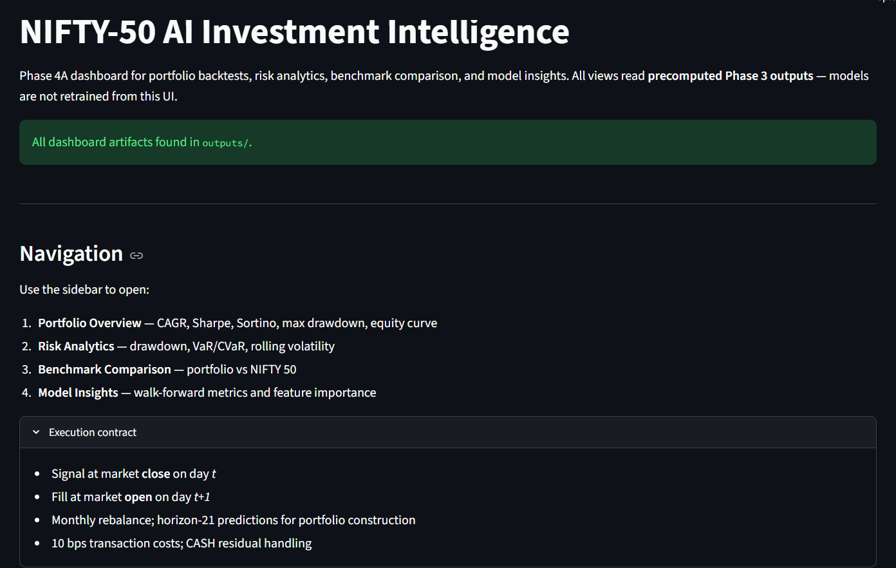
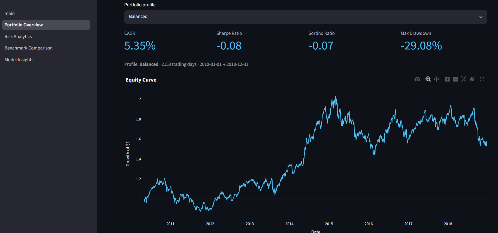
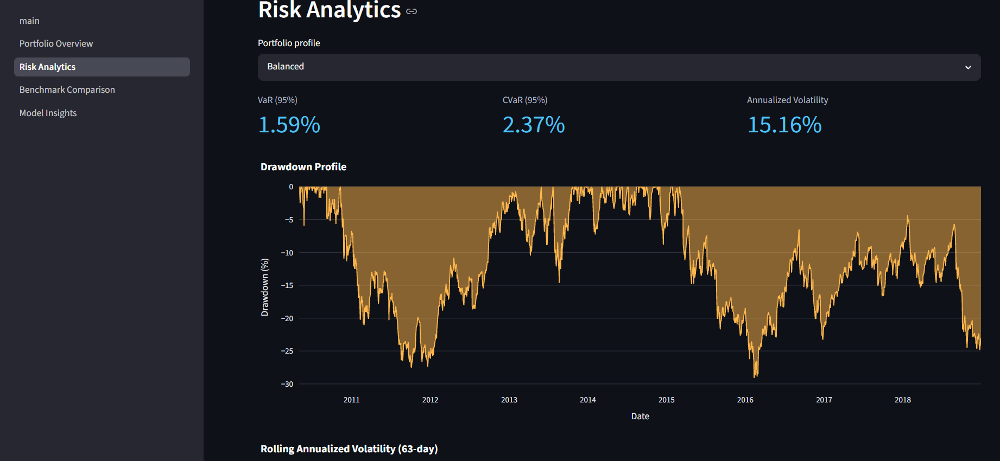
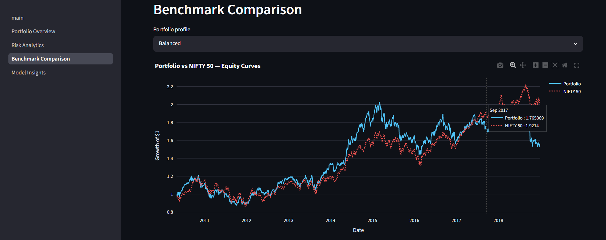
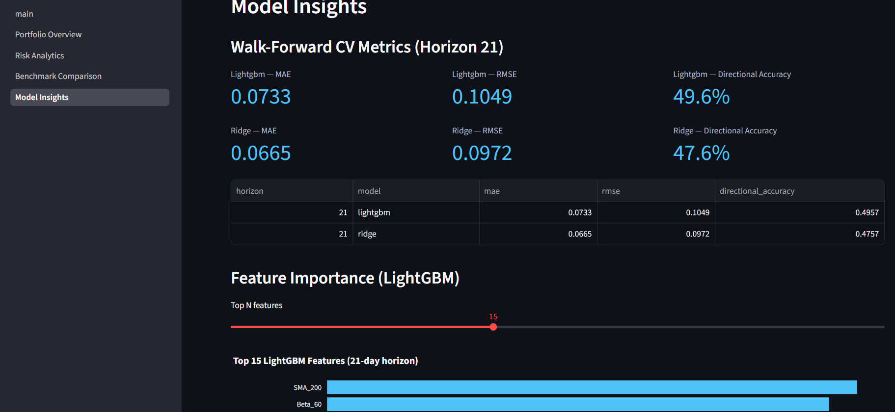

# NIFTY-50 AI Investment Intelligence Platform

<p align="center">
  
</p>

An AI-powered decision-support platform for stock forecasting, portfolio construction, risk assessment, and explainable investment analytics using NIFTY-50 market data.
Built for the Data-Driven Investment Intelligence Challenge using historical NIFTY-50 market data, machine learning forecasting, portfolio optimization, risk analytics, and explainable AI.

## Overview


The **NIFTY-50 AI Investment Intelligence Platform** is an end-to-end decision-support system designed to assist investors in analyzing market behavior, evaluating investment opportunities, constructing risk-aware portfolios, and understanding the factors driving investment recommendations.

The platform transforms historical market data into practical investment intelligence by combining forecasting, portfolio optimization, risk analytics, and explainable AI within a single decision-support framework.
Built using historical NSE market data from January 2000 to April 2021, the platform combines machine learning, portfolio optimization, risk analytics, explainable AI, and interactive visualization into a unified workflow.

Unlike traditional stock-price prediction systems, this project focuses on delivering **actionable investment intelligence** through interpretable forecasts, portfolio recommendations, risk assessment, and performance benchmarking.

---

## Challenge Coverage

| Requirement | Status |
|------------|---------|
| Stock Predictor Engine | ✅ Implemented |
| Portfolio Construction Module | ✅ Implemented |
| Risk Assessment Module | ✅ Implemented |
| Explainable AI | ✅ Implemented |
| Personalized Investor Profiles | ✅ Implemented |
| Interactive Dashboard Deployment | ✅ Implemented |

## Key Features

### Stock Predictor Engine

* Predicts 21-day forward stock returns
* Walk-forward cross-validation framework
* Purged time-series splits to prevent data leakage
* Supports:

  * Ridge Regression
  * LightGBM

### Portfolio Construction Module

Generates portfolios for different investor profiles:

#### Conservative

* Minimum Variance Optimization
* Maximum stock weight: 5%
* Maximum sector weight: 20%
* Cash allocation when constraints prevent full deployment

#### Balanced

* Maximum Sharpe Ratio Optimization
* Maximum stock weight: 10%
* Maximum sector weight: 25%

#### Aggressive

* Black-Litterman Optimization
* Uses model predictions as investment views
* Maximum stock weight: 15%
* Maximum sector weight: 30%

### Risk Assessment Module

Computes portfolio and benchmark risk metrics:

* Annualized Return
* Annualized Volatility
* Sharpe Ratio
* Sortino Ratio
* Maximum Drawdown
* Historical VaR (95%)
* Historical CVaR (95%)

### Explainable AI

* LightGBM Feature Importance
* SHAP Value Analysis
* Feature contribution visualization
* Transparent model interpretation

### Interactive Dashboard

Built using Streamlit with:

* Portfolio Overview
* Risk Analytics
* Benchmark Comparison
* Model Insights & Explainability

---
## Technology Stack

| Category | Tools |
|----------|--------|
| Language | Python |
| ML Models | LightGBM, Ridge Regression |
| Data Processing | Pandas, NumPy |
| Technical Indicators | TA-Lib style custom features |
| Optimization | PyPortfolioOpt |
| Explainability | SHAP |
| Visualization | Plotly |
| Dashboard | Streamlit |
| Storage | Parquet |

# Dataset

Dataset Source:

NIFTY-50 Stock Market Dataset

https://www.kaggle.com/datasets/rohanrao/nifty50-stock-market-data/data

Additional Dataset:

https://www.kaggle.com/datasets/stoicstatic/india-stock-data-nse-1990-2020

The project uses only datasets permitted by the competition guidelines.

### Data Includes

#### Historical Stock Data

* Open
* High
* Low
* Close
* Volume
* Turnover

#### Market Indices

* NIFTY 50
* INDIA VIX
* Sectoral Indices

#### Metadata

* Company Name
* Industry
* Sector Classification

---

# System Architecture

```text
Raw Market Data
       │
       ▼
Data Loader
       │
       ▼
Feature Engineering
       │
       ▼
Prediction Models
(Ridge + LightGBM)
       │
       ▼
OOS Predictions
       │
       ▼
Portfolio Optimization
       │
       ▼
Risk Assessment
       │
       ▼
Backtesting Engine
       │
       ▼
SHAP Explainability
       │
       ▼
Streamlit Dashboard
```

---

# Feature Engineering

More than 50 engineered features are generated from historical price and volume data.

### Trend Indicators

* SMA 20
* SMA 50
* SMA 200
* EMA 20
* EMA 50
* EMA 200

### Momentum Indicators

* RSI
* MACD
* Momentum
* Rate of Change

### Volatility Indicators

* ATR
* Rolling Volatility
* Bollinger Bands

### Market Features

* Beta
* Relative Strength
* Sector Relative Performance
* VIX Features

### Liquidity Features

* Volume Trends
* Turnover Metrics

---

# Stock Predictor Engine

### Prediction Horizon

21 Trading Days

### Validation Method

Purged Walk-Forward Cross Validation

### Models

#### Ridge Regression

Used as a robust linear benchmark.

#### LightGBM

Used as the primary nonlinear forecasting model.

### Evaluation Metrics

* Mean Absolute Error (MAE)
* Root Mean Squared Error (RMSE)
* Directional Accuracy
* Information Coefficient (IC)
* Rank Information Coefficient (Rank IC)

---

# Portfolio Construction

Three portfolio profiles are supported.

| Profile      | Optimizer        | Stock Cap | Sector Cap |
| ------------ | ---------------- | --------- | ---------- |
| Conservative | Minimum Variance | 5%        | 20%        |
| Balanced     | Maximum Sharpe   | 10%       | 25%        |
| Aggressive   | Black-Litterman  | 15%       | 30%        |

Fallback hierarchy:

```text
Primary Optimizer
       ↓
Risk Parity
       ↓
Equal Weight
```

---

# Risk Management

The platform evaluates both portfolio-level and benchmark-level risk.

### Metrics

* Sharpe Ratio
* Sortino Ratio
* Volatility
* Maximum Drawdown
* VaR (95%)
* CVaR (95%)

### Covariance Estimation

Ledoit-Wolf Covariance Shrinkage

---

# Backtesting Framework

### Rebalancing

Monthly

### Execution Policy

Signal generated at:

```text
Close(t)
```

Executed at:

```text
Open(t+1)
```

### Transaction Costs

0.10% one-way slippage

### Benchmark

NIFTY 50 Buy-and-Hold

### No Look-Ahead Bias

All forecasts, covariance estimates, and portfolio decisions use only information available up to the decision date.

---

# Explainability

SHAP explainability is integrated into the pipeline.

### Available Visualizations

* Feature Importance Ranking
* SHAP Summary Plot
* Positive Feature Contributions
* Negative Feature Contributions

Example top drivers include:

* EMA 200
* SMA 200
* SMA 50
* Beta 60
* ATR 14
* VIX Level

---

# Sample Results

### Balanced Portfolio (2010–2018)

| Metric | Value |
|----------|----------|
| CAGR | 5.35% |
| Sharpe Ratio | -0.08 |
| Sortino Ratio | -0.07 |
| Maximum Drawdown | -29.08% |
| Annualized Volatility | 15.16% |
| VaR (95%) | 1.59% |
| CVaR (95%) | 2.37% |

### Walk-Forward Validation (21-Day Horizon)

| Model | MAE | RMSE | Directional Accuracy |
|---------|---------|---------|---------|
| Ridge Regression | 0.0665 | 0.0972 | 47.6% |
| LightGBM | 0.0733 | 0.1049 | 49.6% |

---
# Dashboard

The platform is deployed as an interactive Streamlit application that enables users to explore portfolio performance, risk characteristics, benchmark comparisons, and model explainability through four dedicated modules.

---

## Dashboard Preview

### Home Dashboard

<p align="center">
  
</p>

### Portfolio Overview

<p align="center">
  
</p>

### Risk Analytics

<p align="center">
  
</p>

### Benchmark Comparison

<p align="center">
  
</p>

### Model Insights & Explainability

<p align="center">
  
</p>

---

## Dashboard Modules

### Portfolio Overview
Provides a high-level summary of portfolio performance, including:

- Equity Curve
- CAGR (Compound Annual Growth Rate)
- Sharpe Ratio
- Sortino Ratio
- Maximum Drawdown

### Risk Analytics
Offers detailed risk assessment and downside analysis:

- Value at Risk (VaR)
- Conditional Value at Risk (CVaR)
- Rolling Annualized Volatility
- Drawdown Profile Analysis

### Benchmark Comparison
Compares portfolio performance against the NIFTY 50 benchmark:

- Portfolio vs NIFTY 50 Equity Curves
- Relative Performance Analysis
- Return & Risk Comparison
- Drawdown Comparison

### Model Insights & Explainability
Provides transparency into model behavior and predictions:

- Walk-Forward Validation Metrics
- Feature Importance Analysis
- SHAP Explainability Visualizations
- Positive and Negative Feature Contributions

# Repository Structure

```text
NIFTY-AI-Platform
│
├── app/
│   ├── main.py
│   ├── pages/
│   └── utils/
│
├── assets/
│   ├── dashboard_home.png
│   ├── portfolio_overview.png
│   ├── risk_analytics.png
│   ├── benchmark_comparison.png
│   └── model_insights.png
│
├── data/
│
├── notebooks/
│   ├── 1.0_exploratory_analysis.ipynb
│   ├── 2.0_feature_analysis.ipynb
│   └── 3.0_model_training.ipynb
│
├── outputs/
│
├── src/
│   ├── config.py
│   ├── data_loader.py
│   ├── features.py
│   ├── models.py
│   ├── risk.py
│   ├── portfolio.py
│   └── backtest.py
│
├── ARCHITECTURE.md
├── requirements.txt
└── README.md
```

### Future Extensions

A preliminary anomaly detection module (`src/anomaly.py`) is included as a planned extension for:

- Volatility spike detection
- Abnormal volume detection
- Extreme drawdown event detection

This module is currently a design stub and is not part of the evaluated pipeline.

---

# Installation

```bash
git clone https://github.com/ch-s-h-04/NIFTY-AI-Platform.git

cd NIFTY-AI-Platform

python -m venv .venv

# Windows
.venv\Scripts\activate

# Linux / Mac
source .venv/bin/activate

pip install -r requirements.txt
```

---

# Generate Artifacts

```bash
python -m app.utils.export_artifacts
```

Generates:

```text
outputs/
├── oos_predictions.parquet
├── summary_metrics.parquet
├── fold_metrics.parquet
└── lgbm_feature_importance.parquet
```

---

# Generate SHAP Artifacts

```bash
python -m app.utils.export_shap
```

Generates:

```text
outputs/
├── shap_summary.parquet
└── shap_feature_importance.parquet
```

---

# Run Dashboard

```bash
streamlit run app/main.py
```

or

```bash
python -m streamlit run app/main.py
```

---

# Reproducibility

The repository contains:

* Complete source code
* Feature engineering pipeline
* Model training workflow
* Portfolio optimization engine
* Risk assessment framework
* Explainability module
* Streamlit dashboard

All results can be reproduced using only the datasets provided by the competition organizers.

---

# Competition Alignment

This project satisfies all mandatory tasks:

* Stock Predictor Engine
* Portfolio Construction Module
* Risk Assessment Module

And implements several optional tasks:

* Explainable AI
* Personalized Investment Profiles
* Forecasting Framework
* Interactive Dashboard Deployment

---

# Authors

**Chiranshu Sarraf**

Mechanical Engineering, IIT Roorkee

---

# Disclaimer

This project is developed for educational and research purposes as part of an AI-driven investment intelligence challenge. It does not constitute financial advice or investment recommendations.
